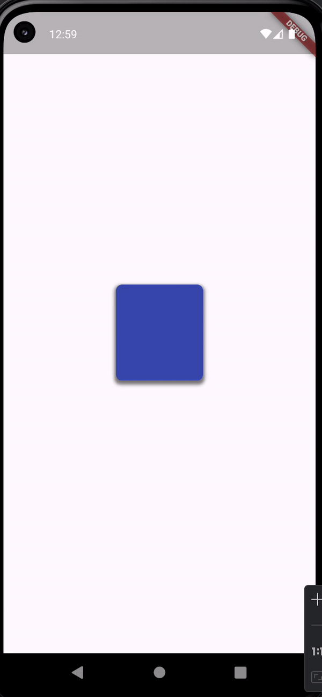
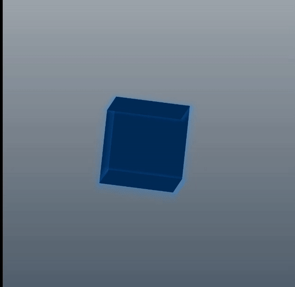
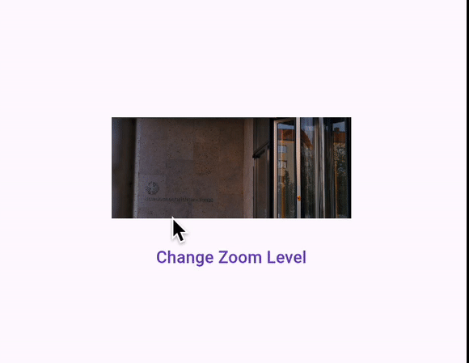

# animation_tutorial

This repository contains a collection of Flutter examples showcasing different types of animations.

## Introduction

Animations in Flutter can greatly enhance the user experience by adding visual appeal and interactivity to your applications. This repository aims to provide clear examples of various animation techniques available in Flutter.

## Usage

### Part 1

### Part 2

### Part 3a

### Part 3b

### Part 4

## Reference 
https://www.youtube.com/playlist?list=PL6yRaaP0WPkW3kwAerPeRqGBvJfO8O4S7

